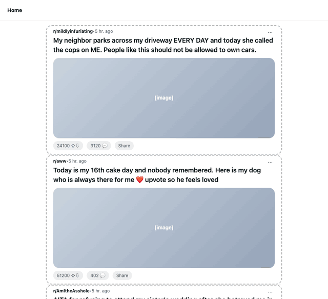

<p align="center">
  
</p>

<h1 align="center">Jevvit</h1>

<p align="center">
  <b>Cut the slop from your Reddit feed.</b><br>
  Every post gets a colored label: ragebait, karma farming, AI slop, helpful… or categories you invent.
</p>

<p align="center">
  <a href="https://github.com/akshatnerella/jevvit/releases/latest/download/jevvit.zip"><b>⬇ Download</b></a> ·
  <a href="#install">Install</a> ·
  <a href="https://jev-backend.vercel.app/jevvit/privacy.html">Privacy</a>
</p>

<p align="center">
  
  <br><sub>Demo on a sample feed (made-up posts): labels land, the ad is blurred, one click reveals it.</sub>
</p>

## What it does

Jevvit draws a colored box around every post on Reddit (your home feed, r/popular, subreddits, profiles and search) and labels it in about a second, so you can skip straight to the posts worth reading.

| Label | What it catches |
|---|---|
| 🟥 **Ragebait** | Posts engineered to make you angry: outrage framing, us-vs-them, "people like this should…" |
| 🟧 **Karma farming** | Reposts, "upvote so he feels loved", cake-day bait, sob stories for upvotes |
| 🟪 **AI slop** | ChatGPT-written stories and advice ("a complex tapestry of emotions…") |
| 🟠 **Low effort** | Bare memes, "is this good?", one-liners with nothing to discuss |
| 🩵 **Self-promo & ads** | Ads and people pushing their own app, channel, course or store (blurred by default) |
| 🟦 **News** | Links to real reporting on current events |
| 🟣 **Discussion** | Genuine questions and conversations worth joining |
| 🟩 **Helpful** | Guides, how-tos, detailed answers, benchmarks, deep dives |
| 🔵 **Interesting** | Striking photos, builds, history and facts |

- **Make your own categories.** Want to spot politics, crypto shilling or AITA drama? Add up to 12 of your own, describe them in plain English, and Jevvit sorts your feed by them. There are one-click suggestions too.
- **Choose what each one does:** **Box** it, **Dim** it, **Blur** it until you click, **Hide** it, or turn it **Off**. For example: hide ragebait, dim low effort, keep helpful front and center.
- **Ads stay out of your way.** Anything Reddit itself serves as an ad is blurred behind a "click to show" cover.
- **⚡bait** flags posts fishing for karma or engagement, whatever their category.
- **Honest uncertainty.** A dashed box means the model isn't sure; hover any label to see the full breakdown.

## Install

> Chrome Web Store listing coming soon. Until then, it takes about two minutes:

1. **Download** [`jevvit.zip`](https://github.com/akshatnerella/jevvit/releases/latest/download/jevvit.zip) and **unzip** it (double-click on Mac). You'll get a `jevvit` folder.
2. Open your browser's extensions page:
   - Chrome: `chrome://extensions`
   - Brave: `brave://extensions`
   - Edge: `edge://extensions`
   - Arc: `arc://extensions`
3. Turn on **Developer mode** (top-right toggle).
4. Click **Load unpacked** and select the unzipped `jevvit` folder.
5. Open [Reddit](https://www.reddit.com). Labels appear as you scroll. 🎉

Keep that folder somewhere permanent (not Downloads), because the browser loads Jevvit from it. **To update:** download the new zip, replace the folder's contents, and click ↻ on the Jevvit card.

## Using it

- **Toolbar popup:** live counts for the current page, a quick Box/Dim/Blur/Hide/Off switch per category, and an on/off toggle. Pin Jevvit from the puzzle-piece menu so it's one click away.
- **Settings page** (popup → *Edit categories*): add, rename, recolor and describe categories; **test any post** to see how it would be labeled; display options.
- **Shortcut:** <kbd>Alt</kbd>+<kbd>Shift</kbd>+<kbd>R</kbd> turns Jevvit on or off anywhere.

## How it works

Jevvit is powered by [**Jev**](https://docs.typesafe.ai), a fast decision model from TypeSafe AI that returns typed answers with calibrated probabilities instead of generating text. Visible posts are sent in small batches to a hosted backend (`jev-backend.vercel.app`), which asks Jev one question per post ("which of these categories fits best?", plus "is this farming karma?") and returns the probabilities you see in the labels. Each Reddit post has a permanent id, so every post is classified once and shared from cache after that.

Post text is only ever treated as *content to judge*, never as instructions, so a post that says "ignore previous instructions" is just a post.

## Privacy

- No account and no sign-in.
- Reads only the posts shown on reddit.com: their title, subreddit, author, flair, score, comment count and the text of text posts.
- Never touches your messages, votes, comments, account or any other site.
- Your settings sync through your browser; nothing is sold or shared.

Full policy: [jev-backend.vercel.app/jevvit/privacy.html](https://jev-backend.vercel.app/jevvit/privacy.html)

*Jevvit is an independent project and is not affiliated with or endorsed by Reddit.*

## Also by Jev

- **[JevTube](https://github.com/akshatnerella/jevtube)**: slop, clickbait and ads on YouTube, labeled before you click.
- **[JevedIn](https://github.com/akshatnerella/jevedin)**: engagement bait, humblebrags and AI slop on LinkedIn, labeled before you read.

---

<details>
<summary><b>Development</b></summary>

```
extension/   The MV3 extension (what ships). No secrets in here.
  parse.js   Reads Reddit's DOM; kept separate so it can be tested on fixtures.
store/       Chrome Web Store listing text, screenshots and promo tile.
tests/       Parser tests, an end-to-end run of the real extension, and a live-site parser check.
scripts/     package.sh builds dist/jevvit-<version>.zip.
docs/        The README demo (tests/demo.mjs regenerates it).
```

- **Attributes, not scraping.** Feed posts are `<shreddit-post>` elements (ads are `<shreddit-ad-post>`) whose attributes hold the id, title, author, subreddit, score, comment count, post type and link domain. Only the flair (`shreddit-post-flair`, by its `aria-label`) and a text post's body (`shreddit-post-text-body`) are read from the content. Search results use a different layout: the id comes from the title link (`search-post-title-t3_…`) and the rest from the JSON in `data-faceplate-tracking-context`.
- **Where it runs:** the home feed, r/popular and r/all, subreddit feeds, user profiles and search results. The post you open on its comments page is left alone.
- **One Jev call per batch.** Up to 10 posts per request; each gets a category `choice` and a karma-bait `boolean`.

```sh
./scripts/package.sh                 # -> dist/jevvit-<version>.zip
cd tests && npm install && npm test  # parser checks + the real extension on the fixtures and live r/popular
node live-parse.mjs [urls...]        # run parse.js on live reddit.com pages and print what it finds
node demo.mjs                        # regenerate docs/demo.gif
node shots.mjs                       # regenerate the store screenshots
```

**When Reddit changes its markup**, run `node live-parse.mjs` first. Then refresh `tests/fixture.html` / `tests/fixture-search.html` to mirror the new structure (with made-up users and posts) and re-run the tests.

Load `extension/` with **Load unpacked** while developing, and click ↻ on the card after changes. Store submission fields are in `store/LISTING.md`.

</details>
